# ProyectoPOO
# Proyecto de programación orientada a objetos

## Tabla de contenidos

* [Definición de alternativa](#definición-de-alternativa)
* [Diagrama UML](#diagrama-uml)
* [Explicación de Objetos, Atributos y Métodos](#explicación-de-objetos-atributos-y-métodos)
* [Sistema de vuelos y rutas](#sistema-de-vuelos-y-rutas)
* [Sistema de pasajeros y equipaje](#sistema-de-pasajeros-y-equipaje)
* [Sistema de tripulación](#sistema-de-tripulación)
* [Sistema financiero](#sistema-financiero)
* [Sistema operativo del aeropuerto](#sistema-operativo-del-aeropuerto)
* [Boarding pass](#boarding-pass)
* [Solución preliminar](#solución-preliminar)

---

# Definición de alternativa

Un aeropuerto internacional necesita un sistema para administrar vuelos, pasajeros, equipaje, combustible, empleados y rentabilidad de cada operación.

El sistema debe permitir:

1. Registrar pasajeros y calcular automáticamente el peso del equipaje.
2. Aplicar cobros adicionales por exceso de equipaje.
3. Verificar disponibilidad de asientos.
4. Generar boarding pass automáticamente.
5. Reprogramar pasajeros cuando un vuelo no tenga disponibilidad.
6. Administrar rutas, ciudades y precios de vuelos.
7. Asignar pilotos y auxiliares de vuelo.
8. Validar combustible suficiente para cada trayecto.
9. Calcular ingresos, gastos y rentabilidad.
10. Administrar clima, retrasos y aprobaciones de despegue.
11. Gestionar seguridad aeroportuaria y migración.
12. Mostrar información completa del vuelo y tripulación.

---

# Diagrama UML

```mermaid
classDiagram

    class Airport {
        +name : str
        +baggage_limit : double
        +extra_baggage_fee : double
        +fuel_cost_per_liter : double
        +register_passenger(passenger : Passenger)
        +validate_available_seats(flight : Flight)
        +assign_passenger_to_flight(passenger : Passenger, flight : Flight)
        +reprogram_passenger(passenger : Passenger)
        +assign_gate(flight : Flight)
        +generate_boarding_pass(passenger : Passenger)
        +check_fuel(flight : Flight)
        +calculate_profit(takeoff : Takeoff)
        +show_takeoff_success()
    }

    class Passenger {
        +id : str
        +name : str
        +document : str
        +nationality : str
        +status : PassengerStatus
        +seat_type : SeatType
        +assign_flight(flight : Flight)
        +change_status(status : PassengerStatus)
        +calculate_baggage_weight()
        +get_total_baggage_weight()
    }

    class VIPPassenger {
        +priority_boarding : bool
        +extra_baggage : double
        +access_lounge()
    }

    class Baggage {
        +id : str
        +weight : double
        +type : str
        +get_weight()
    }

    class Ticket {
        +code : str
        +price : double
        +seat : str
        +status : TicketStatus
        +generate_ticket()
    }

    class BoardingPass {
        +seat : str
        +gate : str
        +show_information()
    }

    class Route {
        +origin : str
        +destination : str
        +distance : double
        +base_price : double
        +calculate_ticket_price()
    }

    class Airline {
        +code : str
        +name : str
        +calculate_extra_charge(extra_weight : double)
    }

    class Flight {
        +flight_number : str
        +route : Route
        +date_time : DateTime
        +gate : String
        +available_seats : int
        +ticket_price : double
        +has_available_seats()
        +assign_passenger(passenger : Passenger)
        +calculate_total_income()
    }

    class FlightDelay {
        +reason : str
        +delay_minutes : int
        +show_delay_information()
    }

    class Weather {
        +condition : str
        +temperature : double
        +affects_flight()
    }

    class ControlTower {
        +approve_takeoff(flight : Flight)
        +assign_runway(flight : Flight)
        +manage_air_traffic()
    }

    class Runway {
        +id : str
        +length : double
        +available : bool
    }

    class Airplane {
        +registration : str
        +seat_capacity : int
        +available_seats : int
        +fuel_capacity : double
        +current_fuel : double
        +fuel_consumption_per_hour : double
        +has_available_seats()
        +has_enough_fuel(hours : double)
        +calculate_required_fuel(hours : double)
    }

    class CommercialPlane
    class CargoPlane
    class PrivateJet

    class Employee {
        +id : str
        +name : str
        +age : int
        +salary : double
        +show_information()
    }

    class Pilot {
        +license_number : str
        +flight_hours : double
        +rank : String
        +approve_takeoff()
    }

    class FlightAttendant {
        +languages : List
        +years_of_experience : int
        +assist_passengers()
    }

    class SecurityCheck {
        +validate_documents()
        +check_baggage()
        +approve_passenger()
    }

    class ImmigrationControl {
        +validate_passport()
        +validate_visa()
    }

    class Lounge {
        +capacity : int
        +allow_access(passenger : Passenger)
    }

    class Meal {
        +type : str
        +price : double
    }

    class Takeoff {
        +id : str
        +flight_hours : double
        +income : double
        +operational_costs : double
        +profitability : double
        +calculate_profitability()
    }

    class PassengerStatus {
        CHECKED_IN
        BOARDING
        ON_FLIGHT
        LANDED
    }

    class SeatType {
        ECONOMY
        BUSINESS
        FIRST_CLASS
    }

    class TicketStatus {
        RESERVED
        PAID
        CANCELED
    }

    Airport o-- Passenger
    Passenger <|-- VIPPassenger
    Passenger *-- Baggage
    Passenger --> BoardingPass
    Passenger --> Ticket
    Passenger --> SeatType
    Passenger --> PassengerStatus

    Flight --> Route
    Flight --> Passenger
    Flight --> FlightDelay
    Flight --> Weather
    Flight --> Pilot
    Flight --> FlightAttendant
    Flight --> Meal

    Airplane <|-- CommercialPlane
    Airplane <|-- CargoPlane
    Airplane <|-- PrivateJet

    Flight --> Airplane
    Flight --> Runway
    Flight *-- Takeoff

    Employee <|-- Pilot
    Employee <|-- FlightAttendant

    Airport --> Airline
    Airport --> ControlTower
    Airport --> SecurityCheck
    Airport --> ImmigrationControl
    Airport --> Lounge

    Takeoff --> FlightStatus
```



---

# Explicación de Objetos, Atributos y Métodos

# Sistema de vuelos y rutas

## Route

Representa una ruta entre dos ciudades.

### Atributos

* `origin` → Ciudad de salida.
* `destination` → Ciudad de llegada.
* `distance` → Distancia total.
* `base_price` → Precio base del trayecto.

### Métodos

* `calculate_ticket_price()` → Calcula automáticamente el precio del vuelo.

---

## Flight

Representa un vuelo programado.

### Atributos

* `flight_number`
* `route`
* `date_time`
* `gate`
* `available_seats`
* `ticket_price`

### Métodos

* `has_available_seats()`
* `assign_passenger()`
* `calculate_total_income()`

---

## FlightDelay

Representa retrasos en vuelos.

### Atributos

* `reason`
* `delay_minutes`

### Métodos

* `show_delay_information()`

---

## Weather

Representa las condiciones climáticas.

### Atributos

* `condition`
* `temperature`

### Métodos

* `affects_flight()`

---

# Sistema de pasajeros y equipaje

## Passenger

Representa un pasajero.

### Atributos

* `id`
* `name`
* `document`
* `nationality`
* `status`
* `seat_type`

### Métodos

* `assign_flight()`
* `change_status()`
* `calculate_baggage_weight()`
* `get_total_baggage_weight()`

---

## VIPPassenger

Representa pasajeros VIP.

### Atributos

* `priority_boarding`
* `extra_baggage`

### Métodos

* `access_lounge()`

---

## Baggage

Representa equipaje.

### Atributos

* `id`
* `weight`
* `type`

### Métodos

* `get_weight()`

---

## Ticket

Representa el boleto del pasajero.

### Atributos

* `code`
* `price`
* `seat`
* `status`

### Métodos

* `generate_ticket()`

---

## BoardingPass

Representa el pase de abordar.

### Atributos

* `seat`
* `gate`

### Métodos

* `show_information()`

---

# Sistema de tripulación

## Employee

Clase base para trabajadores.

### Atributos

* `id`
* `name`
* `age`
* `salary`

### Métodos

* `show_information()`

---

## Pilot

Representa pilotos del vuelo.

### Atributos

* `license_number`
* `flight_hours`
* `rank`

### Métodos

* `approve_takeoff()`

---

## FlightAttendant

Representa auxiliares de vuelo.

### Atributos

* `languages`
* `years_of_experience`

### Métodos

* `assist_passengers()`

---

# Sistema operativo del aeropuerto

## Airport

Clase principal del sistema.

### Atributos

* `name`
* `baggage_limit`
* `extra_baggage_fee`
* `fuel_cost_per_liter`

### Métodos

* `register_passenger()`
* `validate_available_seats()`
* `assign_passenger_to_flight()`
* `reprogram_passenger()`
* `assign_gate()`
* `generate_boarding_pass()`
* `check_fuel()`
* `calculate_profit()`
* `show_takeoff_success()`

---

## ControlTower

Representa la torre de control.

### Métodos

* `approve_takeoff()`
* `assign_runway()`
* `manage_air_traffic()`

---

## Runway

Representa una pista de aterrizaje.

### Atributos

* `id`
* `length`
* `available`

---

## SecurityCheck

Representa seguridad aeroportuaria.

### Métodos

* `validate_documents()`
* `check_baggage()`
* `approve_passenger()`

---

## ImmigrationControl

Representa migración y aduanas.

### Métodos

* `validate_passport()`
* `validate_visa()`

---

## Lounge

Representa salas VIP.

### Atributos

* `capacity`

### Métodos

* `allow_access()`

---

# Sistema de aviones

## Airplane

Clase base para aviones.

### Atributos

* `registration`
* `seat_capacity`
* `available_seats`
* `fuel_capacity`
* `current_fuel`
* `fuel_consumption_per_hour`

### Métodos

* `has_available_seats()`
* `has_enough_fuel()`
* `calculate_required_fuel()`

---

## CommercialPlane

Avión comercial para pasajeros.

---

## CargoPlane

Avión de carga.

---

## PrivateJet

Jet privado.

---

# Sistema financiero

## Airline

Representa la aerolínea.

### Métodos

* `calculate_extra_charge()`

---

## Takeoff

Representa la operación de despegue.

### Atributos

* `id`
* `flight_hours`
* `income`
* `operational_costs`
* `profitability`

### Métodos

* `calculate_profitability()`

---

# Boarding pass

Ejemplo:

```text
Passenger : Andres
Flight    : AV203
From      : Bogotá
To        : Madrid
Seat      : 14A
Class     : Business
Gate      : B2
Captain   : Juan Perez
Crew      : Laura Diaz, Sofia Ruiz
```

---

# Solución preliminar

El sistema integra múltiples conceptos de programación orientada a objetos:

* Herencia.
* Encapsulamiento.
* Polimorfismo.
* Composición.
* Agregación.
* Relaciones entre clases.
* Manejo de estados.
* Validaciones operativas.
* Simulación de procesos reales.

El proyecto representa un sistema aeroportuario completo capaz de administrar:

* Pasajeros.
* Equipaje.
* Vuelos.
* Rutas.
* Tripulación.
* Combustible.
* Seguridad.
* Migración.
* Rentabilidad.
* Operaciones de despegue.
* Boarding pass.
* Control de tráfico aéreo.
